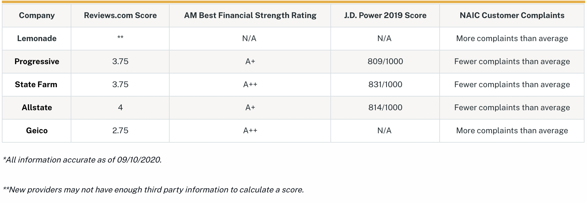
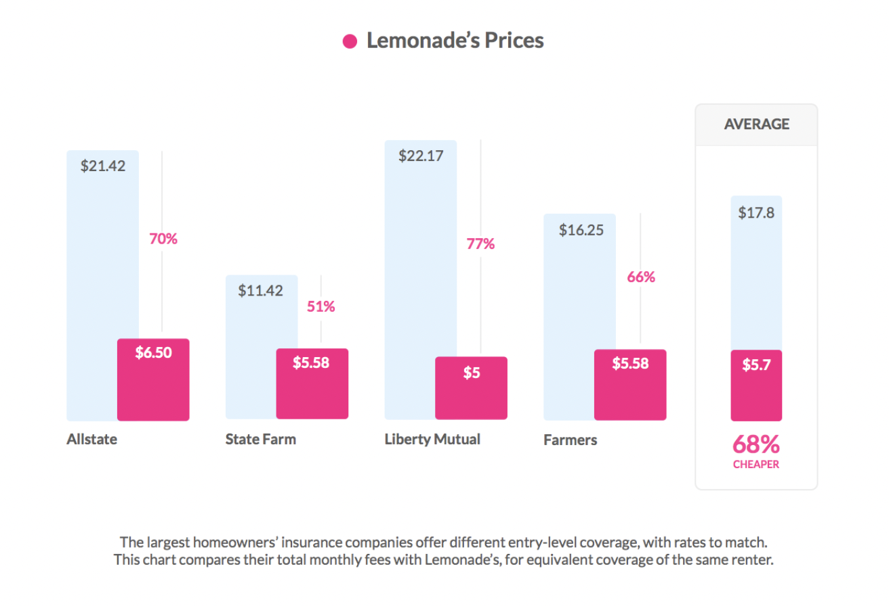

# Unit 1 Homework Assignment: FinTech Case Study

## Overview and Origin

- **Name of company**

*Lemonade, Inc.*

- **When was the company incorporated?**

*April 2015*

- **Who are the founders of the company?**

*Daniel Schreiber (CEO)*
  + *Daniel was an attorny prior to his enterprenour ship. He worked for a law firm before he started multiple start-ups which did not kicked off until Lemonade has been founded.*

*Shai Wininger (President & COO)*
  + *Shai has been an entreprenous for some time and worked in the technolgy industry. He started multiple start-ups. Some failed, some succeeded.*

- **How did the idea for the company (or project) come about?**

*Daniel wanted to start a new business and came to the conclusion that the insurance industry hasnt changed much over time. The average age of an insurance company is more than 100 years. Its one of the oldest businesses we know of - going back into the 16 hundreds. It was time to disrupt and revolutionary the insurance industry. Not knowing anything on how insurance works - but knowing that almost everybody will own an insurance in their lifetime. Key factorbut dislikes the process of getting the policy to the point of the claim process. The goal was - making insurance atractive, intresting and easy. It shouldnt be a burdon to get an insurance or receive a claim. Lemonade is changing the industry by using AI, machine learning and bots. Removing partially the human factor.*

*90 seconds to get insured - meaning you get an insureance before your coffee order has been completed.*

- **How is the company funded? How much funding have they received?**

*Lemonade has been gone through multiple rounds of funding. Started with seed funding from Sequoia Capital and Aleph for $13 million. Ending with their IPO in June 2020 rounding up more than $600 million in total funding. The main investor is SoftBank Group holding about 27% of Lemonade.*

---

## Business Activities

- **What specific financial problem is the company or project trying to solve?**

*Reinventing the insurance industry by using top of the art technoligy and simplefying the end to end process.*

- **Who is the company's intended customer?  Is there any information about the market size of this set of customers?**

*Lemonades customers are Renters, Homeowners and Petowners. At the beginning the focus was on new customers who have not bought an insureance before. This group made about 85% of their customers where 15% came from competitetors.*

- **What solution does this company offer that their competitors do not or cannot offer? (What is the unfair advantage they utilize?)**

*The solution/service from Lemonade does not differ from other/more established inurance companies. Lemonade tries to separate themselves by changing how insurance should work - Focusing on the customer experience.*

- **Which technologies are they currently using, and how are they implementing them? (This may take a little bit of sleuthing–– you may want to search the company’s engineering blog or use sites like Stackshare to find this information.)**

*Big data and Machine Learning helps Lemonade to streamline the pricing module by also always prevent 'unfair discremination'. This can occure by forming specific groups into its own risk category. Changing the classification, risk groups and applying big data allows Lemonade to offer a more detailed insurance policy and pricing*

*Lemonade is using smart algorithms to automate the claim handling process. It allows Lemonade to reduce the strains associated with the end-to-end process (Claim, investigtion, fraud, filing and getting paid). Removing partically the human factor and automate the handling process can bring down the claim from weeks to seconds.*

*Lemonade's most powerful employees are Maya (Virtual Assistant Bot) and Jim (AI Bot). As Lemonade acknowledge that AI and Machine Learning are powerful tools and not always flawless - Employees are still a key factor which will come to play once Maya and Jim hit road blocks.*

*Maya: Collects information, provides quotes, and handles the payments. leverages early detection of catastrophes system to react to developing catastrophes in real-time. The bot automatically blocks areas and alerts Lemonade's human claims team of potential emergencies. Maya also helps the company to notify users of nearby fires and severe weather events as they develop. The more Maya chats, the smarter it gets as the Machine Learning models are retrained almost daily. Maya is fueled by NLP (Natural Language Processing) and NAS (Natural Action Synthesis).*

*Jim: Can read the nature of claims, their severity, and whether the customer is in a state of emergency. AI Jim also investigates the likelihood of a claim being dishonest. The bot even pushes people to be more honest by combining years of behavioral economics research into every tiny detail in the conversation.*

---

## Landscape

- **What domain of the financial industry is the company in?**

*InsurTech / Insurance Industry*

- **What have been the major trends and innovations of this domain over the last 5-10 years?**

*InsurTech is an entirely new business module that keeps evolving. Applying the latest technology tools such as big data, AI, machine learning and bots to simplify and speed up the insurance process. Within the claim process, the industry has seeing companies using drones for on-demand video inspection of potential claims/fraud investigations.*

*A big factor seeing across most insurance companies are implemented bots to support the customer and guide them through the policy process as well as pin-point customers into the right direction to get their questions answered/helped.*

*Mobile App support and moving from offline to online*

- **What are the other major companies in this domain?**

| InsureTech 	| Insurance   	|
|------------	|-------------	|
| Sure, Inc  	| AllState    	|
| Slice      	| Geico       	|
| Trov       	| State Farm  	|
|            	| Progressive 	|

---

## Results

- **What has been the business impact of this company so far?**

1. Giveback:
  * The idea is very straight forward. Lemonades margin is based on a 25% flat fee for each signed policy. The remaining 75% are being used to pay claims - Everything remaining which has not been paid out for several reasons is going to a cause of policy holders choice within your risk/policy category/profile. Every year - Lemomande was able to donate to cause and its growing. 2020 give back has been almost doubled compare to 2019 and is trending to increase with more customers joining the Lemonade hype.
  
2. Claims Processing and Pricing/Policy Moduling:
  * Lemonades individuel touch by offering a more tailored policy by also reducing the cost is a key factor which other companies will need to adopt. This can only occure by using the technology available and re-organize companies infrastructure. Going back to the white-board and making the neccessary changes to be and stay competitve.

- **What are some of the core metrics that companies in this domain use to measure success? How is your company performing, based on these metrics?**

***Customer Satisfaction***

*This area is where Lemonade is exptected to perform outstanding. However, it seems that Lemonade is being outperformed by 50+ other insurance companies. This could also be due to the fact that Lemonade is new in the domain.*

***Pricing***

*Not brokers and bureaucracy allows Lemonade to offer same coverage as other competetors for less than 50%. Have to keep in mind that not all competitors are offering the same policy categories. However, similiar to saving 15 minutes can save up to 15% of car insureance - Lemonade can save 80% in 90 seconds.*

- **How is your company performing relative to competitors in the same domain?**

*Lemonade is still in the early stages of being a big player within the insurance industry having a market share of less than 1%. However, early indiactions are showing that the new insurance module by utlizing Big Data, AI and machine learning are giving Lemonande an edge in pricing and processing. Allowing to offer cutom policies for less costs.*

*Managed customers by human shows the trend of the industry. However, it is still not clear how customers are going to appreciate the 'Human Factor' when it comes to claims which cannot be processed by Maya or Jim.*

*Lemonade is expected to be perform better in customer relationship and satisfaction. However, it appears that other insurance providers are picking up the pace and perfoming equal or even better as Lemonade.*

---

## Recommendations

- **If you were to advise the company, what products or services would you suggest they offer? (This could be something that a competitor offers, or use your imagination!)**

*Lemonade only provides Renters-, Homeowners insurance and just recently added Pet Insurance. Lemonade also expanded outside the US market to establish a business in Europe. The focus should be to extend the business module further by adding additional policies and insurance categories such as car insurance as well as a broader rollout.*

*Further, I would re-evaluate the Giveback approach. Part of Lemonade's approach is that not used premiums will go back to cause. Changing the allocation of the remaining funding by also giving back to the insurer which did not process a claim.*

*Allowing customers to choose between AI or Human could open the market for a different generation. However, this will come with higher costs which could be allocated across all insurance categories but still going to be cheaper as competitors. Offering the hybryd solution prior to frustration when working with AI.*

- **Why do you think that offering this product or service would benefit the company?**

*Adding addtional insurance policies and categories allows the company to build their customer base. Currently, Lemonade is limited in their offering.*

*Re-evaluating the Giveback approach would add more social behavior into the claim process. Knowing that not used premiums have been increasing year by year could build a behavior that someone might not process their claim as the Giveback percentage might be higher as the potential claim and change in policy pricing*

---

## Appendix - Research Material

### 1. Podcasts
* *[Dollars and Change Podcast - Lemonade Insurance with Daniel Schreiber](https://open.spotify.com/episode/23ZQ9XFK1LfvNUokVbBhDn?si=El0IdXLvQT6uIJG7DCZ91A)*
* *[The Insurance Innovators Unscripted Podcast - Ep 014: Daniel Schreiber – Lemonade and Insurance Innovation](https://open.spotify.com/episode/5ppkfeB4mlTy91NycuhTwl?si=pVbjVxa4RG2V6cgyDHqgxg)*
* *[Banking Transformed with Jim Marous - How Fintech Unicorn Lemonade is Disrupting Insurance](https://open.spotify.com/episode/6LSFS9nniWv2V5mkyPIOQi?si=3W561VMrT1-4qKZ5d2_syw)*

### 2. Websites
+ #### Lemonade
  + *[The Lemonade Transparency Chronicles](https://www.lemonade.com/blog/lemonade-transparency-chronicles/?utm_source=quora&utm_content=08_08_2017)*
  + *[Lemonade’s First Quarter in Market](https://www.lemonade.com/blog/lemonade-transparency-chronicles/?utm_source=quora&utm_content=08_08_2017)*
  + *[Saving 80% In 90 Seconds?](https://www.lemonade.com/blog/saving-80-90-seconds/)*
  + *[The Secret Behind Lemonade’s Instant Insurance](https://www.lemonade.com/blog/secret-behind-lemonades-instant-insurance/)*
  + *[Lemonade FAQ](https://www.lemonade.com/faq)*

+ #### Forbes
  + *[The Power Of Purpose: How Lemonade Is Disrupting Insurance With Goodness (And A New Foundation)](https://www.forbes.com/sites/afdhelaziz/2020/03/09the-power-of-purpose-how-lemonade-is-disrupting-insurance-with-goodness-and-a-new-foundation/?sh=1c3f828f7288)*
  + *[First, Fire All The Brokers: How Lemonade, A Millennial-Loved Fintech Unicorn, Is Disrupting The Insurance Business](https://www.forbes.com/sites/jeffkauflin/2019/05/02/lemonade-fintech-insurance-unicorn/?sh=7da4dd106cde)*
  + *[Lemonade IPO Shows The Power Of AI (Artificial Intelligence)](https://www.forbes.com/sites/tomtaulli/2020/07/03/lemonade-ipo-shows-the-power-of-ai-artificial-intelligence/?sh=3874271d3aeb)*

+ #### Others
  + *[How Lemonade Insurance Works](https://www.reviews.com/insurance/homeowners/how-lemonade-insurance-works/)*
  + *[Linkedin](https://www.linkedin.com/company/lemonade-inc-)*
  + *[Israeli-founded Lemonade insurance startup sets its sight on Europe](https://www.timesofisrael.com/israeli-founded-lemonade-insurance-startup-sets-its-sight-on-europe/)*
  + *[Don’t Believe The Hype – The Lemonade Story](https://insnerds.com/lemonade-hype/)*
  + *[Three insurtech trends to watch in 2020](https://www.fintechmagazine.com/fraud-and-cybersecurity/three-insurtech-trends-watch-2020)*
  + *[Lemonade claims to have fastest-growing segment of NY renters market](https://www.insurancebusinessmag.com/us/news/technology/lemonade-claims-to-have-fastestgrowing-segment-of-ny-renters-market-71108.aspx)*
  + *[Lemonade Homeowners Insurance Review](https://www.reviews.com/insurance/homeowners/lemonade-review/)*
  + *[The Lemonade Insurance Business Model – How Does Lemonade Insurance Work & Make Money?](https://productmint.com/the-lemonade-insurance-business-model-how-does-lemonade-insurance-make-money/#:~:text=Shai%20Wininger%20and%20Daniel%20Schreiber,start%20an%20internet%20security%20company.)*
  + *[Owler](https://www.owler.com/company/lemonade)*
  + *[Wikipedia](https://en.wikipedia.org/wiki/Lemonade,_Inc.)*
  + *[The S-1 Club | Is Lemonade more than another SoftBank growth-machine?](https://thegeneralist.substack.com/p/the-s-1-club-is-lemonade-more-than)*
  + *[How Machine Learning generated $100M in 2.5 years for an insurance company?](https://arekskuza.com/the-innovation-blog/machine-learning-startup-lemonade/#:~:text=Lemonade%20was%20born%20with%20Machine,thereby%20quoting%20a%20relevant%20premium.&text=They%20are%20compiled%20by%20AI,data%20and%20monitor%20loss%20ratios)*
  + *[How is machine learning/artificial intelligence affecting the insurance industry?](https://www.quora.com/How-is-machine-learning-artificial-intelligence-affecting-the-insurance-industry)*
  + *[How do insurance companies use machine learning?](https://www.quora.com/How-do-insurance-companies-use-machine-learning)*
  + *[Stackshare](https://stackshare.io/companies/lemonade)*

